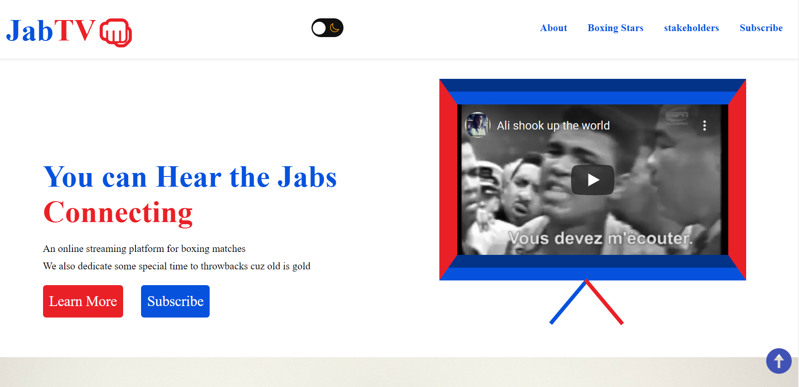

# JabTV Landing Page

A landing page website template for campers. Made with the love of boxing at heart.

## Author

[@koladechris](https://www.twitter.com/koladechris)

## Github repo

This is the [link](https://github.com/Ksound22/JabTV-Landing-Page) to the Github repo of the project

## Sample Website

A live demo is already available via this [link](https://xenodochial-poincare-9143f8.netlify.app)

## Tech Stack

**Client:** HTML, CSS, Vanilla JavaSCript

## Tools Used

Below are are list of tools used, and the precise things they were used for:

- [Ion Icons](https://ionic.io/ionicons) for dark theme switcher icons
- [Icon8](https://icons8.com/) for scroll-tot-top icon
- [Roboto font](https://icons8.com/) for font family
- [Favicon IO](https://favicon.io/favicon-generator/) for favicons.

## Folder Structure

The index.html and readme files are in the root folder, alongside the screenshot included in the readme.

The assets folder contains the CSS and JavaScript files, all images and icons used, in their respective folders.

## Customization Guide

The various sections in the HTML and CSS are well commented, so feel free to change whatever doesn't suit your need.

The JavaScript functions are commented too, so you will know what the functions and selections do.

I used Ion Icons and Icons8 for the icons, but feel free to use fontawesome or any other icon library you want.

For the subscription form submission, you can use formspree since you're just going to collect emails. You can use a more elaborate service like Mailchimp or Convertkit for this purpose.

In addition to formspree, you can also use Netlify form submission in case you deploy there. Brad Traversy has a [video tutorial](https://www.youtube.com/watch?v=6ElQ689HRcY) on how to do it.

If you encounter problems customizing, reach out to me by sending me a DM on my [Twitter](https://www.twitter.com/koladechris).

## Acknowledgements

- [Awesome Readme Templates](https://awesomeopensource.com/project/elangosundar/awesome-README-templates)
- [Awesome README](https://github.com/matiassingers/awesome-readme)
- [How to write a Good readme](https://bulldogjob.com/news/449-how-to-write-a-good-readme-for-your-github-project)
